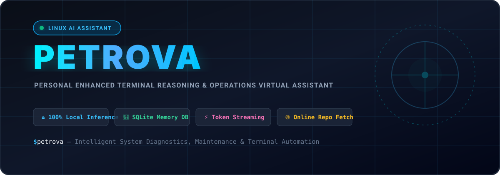
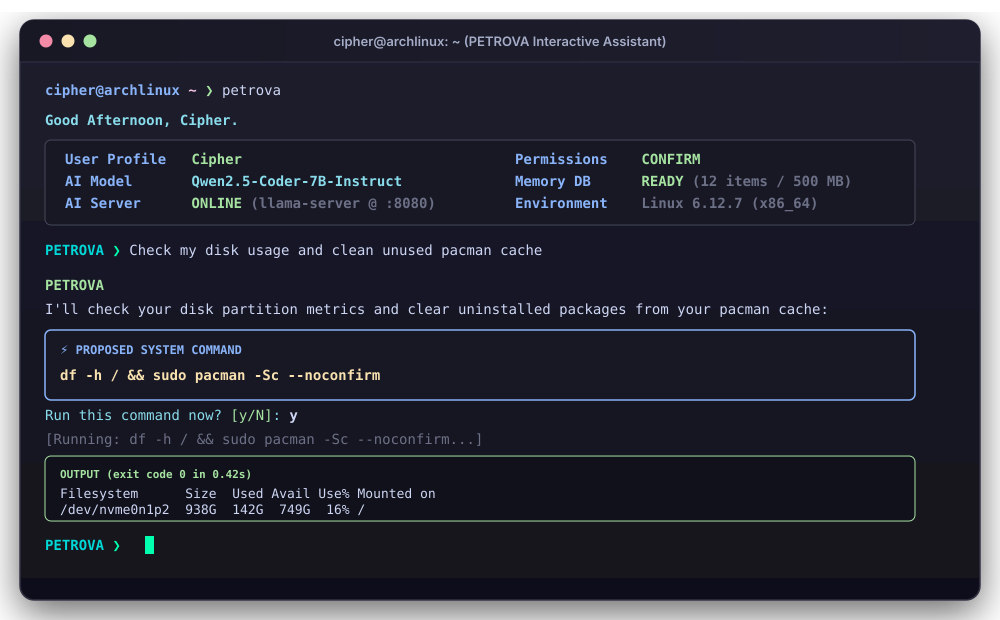
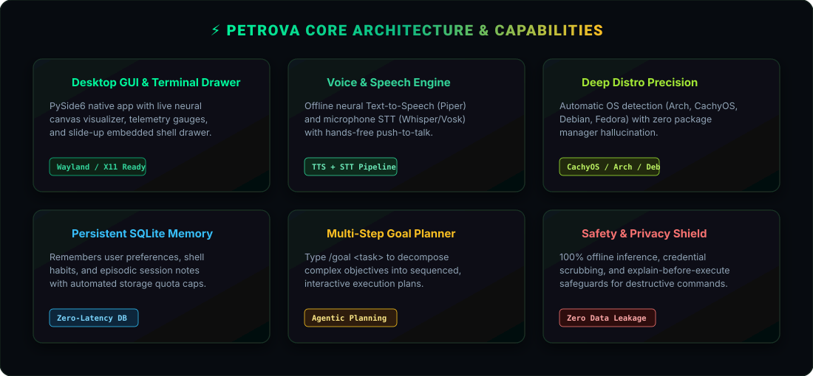
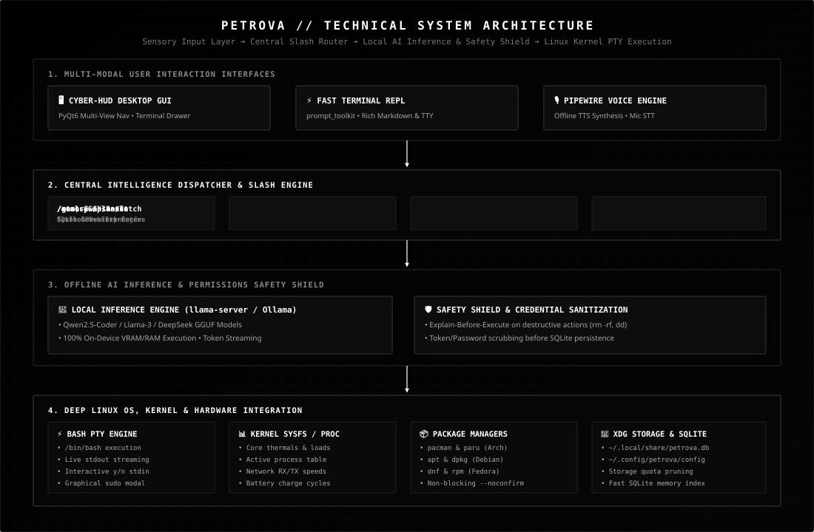

<p align="center">
  
</p>

<p align="center">
  <b>Personal Enhanced Terminal Reasoning &amp; Operations Virtual Assistant</b><br>
  <i>An autonomous, privacy-first AI Operating Command Center and companion engineered natively for Linux.</i>
</p>

<p align="center">
  <a href="https://github.com/Priyanshukumar2904/PETROVA"></a>
  <a href="https://github.com/Priyanshukumar2904/PETROVA"></a>
  <a href="https://github.com/Priyanshukumar2904/PETROVA"></a>
  <a href="https://github.com/Priyanshukumar2904/PETROVA"></a>
  <a href="https://github.com/Priyanshukumar2904/PETROVA"></a>
  <a href="https://github.com/Priyanshukumar2904/PETROVA"></a>
  <a href="LICENSE"></a>
</p>

---

## 🌟 Overview

**PETROVA** is an open-source, 100% local AI Operating Assistant designed natively for Linux power users, sysadmins, and developers. It bridges local Large Language Models (LLMs) directly with the Linux kernel, package managers, and storage subsystems, combining intelligent system tooling, real-time command execution, proactive hardware telemetry, a unified monochrome Cyber-HUD desktop interface, hands-free voice interaction, and persistent long-term SQLite memory.

Unlike cloud chatbots that send telemetry and private shell interactions to remote servers, PETROVA runs **completely offline on your hardware**, keeps all preferences in your local XDG directory, and interfaces directly with local inference backends (`llama.cpp`, `Ollama`, or local OpenAI-compatible endpoints).

---

## ⚡ Interactive Terminal Walkthrough

<p align="center">
  
</p>

---

## 💎 Core Architecture & Capabilities

<p align="center">
  
</p>

---

## 🚀 Key Features & Updates

### 🖥️ V1 Monochrome Cyber-HUD Desktop GUI
* **Strict Minimalist Aesthetic**: High-contrast black & white wireframe interface (`#000000` / `#FFFFFF`) with high-readability typography (14.5px+ base) and zero visual clutter.
* **Unified Multi-View Navigation Stack**:
  * **⌂ HOME / 💬 AI CHAT**: Conversational AI command center with action pills (`[ ⚡ RUN ]`, `[ INSPECT ]`, `[ CLEAN ]`), quick chips, and collapsible terminal drawer.
  * **📈 SYSTEM**: Live hardware telemetry meters, thermal sensors, and real-time top CPU/RAM process inspector.
  * **📁 FILES**: Storage partition monitor, large directory scanner (`Downloads`, `~/.cache`, `/var/log`), and 1-click cache cleaners.
  * **📋 TASKS**: Autonomous goal planner and background task queue supervisor.
  * **⚙️ SETTINGS**: System configuration, AI backend endpoint supervisor, voice profile selectors, and SQLite memory vault.

### 💻 Real Linux Pseudo-Terminal (PTY) Engine
* **Genuine Linux TTY**: Subprocesses execute inside true Linux Pseudo-Terminals (`pty.openpty()`) in `/bin/bash` with full user `$PATH` and environment variable inheritance.
* **Interactive Prompts (`y/n`)**: Real-time line-by-line output streaming with live interactive stdin forwarding.
* **Secure Sudo Authentication Modal**: Root commands trigger a secure graphical password popup and pipe credentials via `sudo -S -p ""` without raw TTY hangs.
* **Auto Package Management Normalization**: Automatically optimizes pacman system upgrades (`sudo pacman -Syu --noconfirm`) for smooth non-blocking execution.

### 🎙️ Hands-Free Voice Interaction Subsystem
* **Prominent Toggle Controls**: Click `[ 🔊 Voice: ON / OFF ]` anywhere from the top bar or input bar to mute/unmute spoken voice feedback.
* **Optimized Microphone STT**: Direct PipeWire/PulseAudio capture with 2.5x volume normalization, ambient energy calibration, and live speech feedback (`[ 🔴 Recording (5s)... ]`).

### ⚡ Full GUI Slash Command Support
All built-in slash commands run directly from the desktop chat input or CLI REPL:
* `/help` — Built-in interactive command reference
* `/stats` — Live CPU thermals, RAM, GPU, and system telemetry card
* `/status` — AI model, server status, memory stats, and permissions mode
* `/goal <objective>` — Autonomous multi-step goal synthesizer and executor
* `/memory [list|add|search|delete|clear]` — Full SQLite memory vault manager
* `/server [status|start|stop]` — Local inference supervisor (`llama-server`)
* `/web <query>` — Lightweight DuckDuckGo search without API keys
* `/fetch <url>` — Web page and GitHub repository extractor
* `/run <command>` — Direct shell execution in the terminal drawer

### ⌨️ Comprehensive Keyboard Shortcuts
* `[H]` — Switch to **Home / AI Chat**
* `[A]` — Focus **AI Input Bar**
* `[S]` — Switch to **System Process Monitor**
* `[F]` — Switch to **Files & Storage Analyzer**
* `[T]` — Switch to **Tasks Queue**
* `[G]` — Switch to **Settings & Preferences**
* `[Q]` — Quit Application
* `[Ctrl + `]` — Toggle Slide-Up Terminal Drawer
* `[Ctrl + M]` — Open Memory Knowledge Vault

---

## 📦 Installation & Setup

### Automated One-Step Install (Recommended)
```bash
git clone https://github.com/Priyanshukumar2904/PETROVA.git
cd PETROVA
chmod +x install.sh
./install.sh
```

### Manual Setup
```bash
git clone https://github.com/Priyanshukumar2904/PETROVA.git
cd PETROVA
python3 -m venv .venv
source .venv/bin/activate
pip install -e .
```

### Launching PETROVA
1. **Desktop Menu**: Click **PETROVA** in your application launcher (GNOME, KDE Plasma, Rofi, Wofi).
2. **Dedicated GUI Mode**: Run `petrova-gui` or `petrova --gui`.
3. **Terminal REPL**: Run `petrova` from any shell.

---

## 🏗️ Architecture Overview

<p align="center">
  
</p>

---

## 📜 License

Distributed under the **MIT License**. See [LICENSE](LICENSE) for details.

Developed with ❤️ by [Priyanshukumar2904](https://github.com/Priyanshukumar2904).
