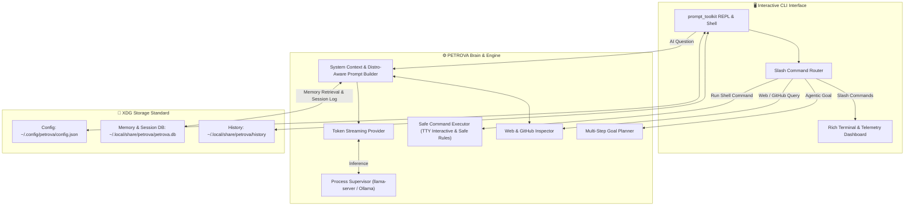

<p align="center">
  
</p>

<p align="center">
  <b>Personal Enhanced Terminal Reasoning & Operations Virtual Assistant</b>
</p>

<p align="center">
  <a href="https://github.com/Priyanshukumar2904/PETROVA"></a>
  <a href="https://github.com/Priyanshukumar2904/PETROVA"></a>
  <a href="https://github.com/Priyanshukumar2904/PETROVA"></a>
  <a href="https://github.com/Priyanshukumar2904/PETROVA"></a>
  <a href="https://github.com/Priyanshukumar2904/PETROVA"></a>
  <a href="LICENSE"></a>
</p>

---

## 🌟 Overview

**PETROVA** is an open-source, privacy-first AI Operating Assistant designed for Linux. It combines local Large Language Models (LLMs), intelligent system tooling, real-time command execution, proactive hardware telemetry, and persistent long-term SQLite memory to help you understand, maintain, diagnose, and automate your Linux system.

Unlike cloud chatbots that send your data across the internet, PETROVA runs **100% locally on your machine**, keeps your history private, and directly connects to local inference backends (`llama.cpp`, `Ollama`, or OpenAI-compatible APIs).

---

## 🎬 Live Terminal Walkthrough

<p align="center">
  
</p>

---

## 💎 Core Architecture & Capabilities

<p align="center">
  
</p>

---

## ✨ Key Features

- 🚀 **1-Command Global Startup**: Launch your assistant from any terminal prompt simply by typing `petrova`.
- 🌟 **Proactive Health Briefings & Empathy**: Greeted with live CPU temperatures, RAM usage alerts, and continuity memory from your previous session.
- 🐧 **Deep Distro Precision**: Automatically detects your exact Linux distribution (e.g. CachyOS / Arch) and formulates native package commands (`sudo pacman -Syu`, `paru -Syu`, `cachyos-rate-mirrors`).
- ⚡ **Interactive Full-Screen TTY Support**: Run full-screen interactive tools (`htop`, `btop`, `top`, `vim`, `nano`) directly inside the session, returning smoothly upon exit.
- 🎯 **Multi-Step Goal Planner (`/goal`)**: Decompose complex objectives into sequenced, interactive execution plans.
- 🧠 **Persistent SQLite Memory**: Remembers user preferences, project notes, and shell habits across sessions with automated storage quota caps (`~/.local/share/petrova/petrova.db`).
- 🌐 **Live Web & GitHub Inspector**: Pass any URL or GitHub repo link (`https://github.com/...`) in chat or via `/fetch`, and PETROVA will analyze the live repository structure and README.
- 🏎️ **Zero-Latency Token Streaming**: Real-time SSE token streaming renders responses instantly token-by-token with live tokens/sec and thermal stats.

---

## 🚀 Quick Start & Installation

### Option 1: One-Step Automated Install (Recommended)
```bash
git clone https://github.com/Priyanshukumar2904/PETROVA.git
cd PETROVA
chmod +x install.sh
./install.sh
```

### Option 2: Manual Setup
```bash
git clone https://github.com/Priyanshukumar2904/PETROVA.git
cd PETROVA
python3 -m venv .venv
source .venv/bin/activate
pip install -e .
```

### Launching PETROVA
From **any terminal window** on your system, simply run:
```bash
petrova
```

---

## 📖 Built-in Slash Commands

| Command | Description |
| :--- | :--- |
| **`/help`** | Display complete command reference table |
| **`/goal <objective>`** | Plan and execute a multi-step agentic objective with live progress |
| **`/run <command>`** *(or `!<cmd>`)* | Safely execute a Linux shell command with live duration metrics |
| **`/stats`** | Display live hardware, CPU temperature, RAM gauge, and storage dashboard |
| **`/fetch <url>`** | Fetch and inspect any live web page or GitHub repository |
| **`/web <query>`** | Search the web without needing external API keys |
| **`/status`** | View live system health, AI server, permissions, and memory usage |
| **`/config view`** | View all active configurations and settings |
| **`/config name <name>`** | Change the name PETROVA addresses you by |
| **`/config permissions`** | Switch execution mode (`confirm`, `autonomous`, `read_only`) |
| **`/config memory <mb>`** | Adjust SQLite database storage quota cap in MB |
| **`/setup`** *(or `/config reset`)* | Re-run the full 4-step onboarding wizard |
| **`/memory list`** | View all stored persistent memories and preferences |
| **`/memory search <query>`** | Search stored memories by keyword relevance |
| **`/memory add <fact>`** | Manually store a persistent memory item |
| **`/memory delete <id>`** | Delete a specific memory item by ID |
| **`/server start \| stop \| status`** | Manage local background AI inference supervisor |
| **`/clear`** | Clear terminal screen |
| **`/exit`** *(or `/quit`)* | Exit session (automatically records session journal) |

---

## 🏗️ Architecture



---

## 🛡️ Privacy & Security

* **100% Local Inference**: Your prompts, shell inputs, and file data stay entirely on your device.
* **Explain-Before-Execute**: High-risk destructive commands (`rm -rf`, `mkfs`, `dd`, `chmod 777`) are automatically flagged with warning prompts regardless of autonomy mode.
* **Credential Scrubbing**: Passwords, API tokens, and private keys are detected and strictly discarded from persistent memory storage.

---

## 📜 License

Distributed under the **MIT License**. See [LICENSE](LICENSE) for details.

Developed with ❤️ by [Priyanshukumar2904](https://github.com/Priyanshukumar2904).
