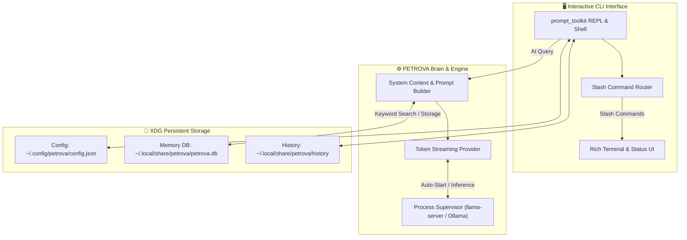

# ⚡ PETROVA

<p align="center">
  <b>Personal Enhanced Terminal Reasoning & Operations Virtual Assistant</b>
</p>

<p align="center">
  
  
  
  
  
</p>

---

## 🌟 Overview

**PETROVA** is an open-source, privacy-first AI Operating Assistant for Linux. It combines local Large Language Models (LLMs), intelligent system tooling, and persistent long-term memory to help you maintain, troubleshoot, and automate your Linux system.

Unlike cloud chatbots, PETROVA runs **100% locally on your machine**, respects your privacy, keeps your conversation data on your own filesystem, and connects directly to your local AI engine (llama.cpp / Ollama / OpenAI-compatible APIs).

---

## ✨ Key Features

- 👤 **Interactive Personalization**: On first launch, PETROVA greets you and asks what name to address you by.
- 🧠 **Multi-Backend AI Engine**: Works seamlessly with **llama-server (GGUF)**, **Ollama**, or any **OpenAI-compatible local API** (vLLM, LM Studio, LocalAI).
- 🚀 **Auto-Server Supervisor**: Automatically starts your local model backend in the background upon launching.
- ⚡ **Real-Time Token Streaming**: Instant token-by-token response rendering without terminal freezing.
- 💾 **Persistent SQLite Memory**: Remembers user preferences, project notes, and custom instructions across sessions (`~/.local/share/petrova/petrova.db`).
- ⌨️ **Advanced CLI Experience**: Built with `prompt_toolkit` and `rich`, featuring Up/Down history, Tab auto-completion, and slash commands.

---

## 🚀 Quick Start & Installation

### 1. Clone the Repository
```bash
git clone https://github.com/Priyanshukumar2904/PETROVA.git
cd PETROVA
```

### 2. Install Dependencies
```bash
python3 -m venv .venv
source .venv/bin/activate
pip install -e .
```

### 3. Launch PETROVA
```bash
petrova
```
> *On first run, PETROVA will automatically launch an interactive setup wizard to configure your preferred name and AI model backend.*

---

## 📖 Built-in Slash Commands

| Command | Action |
| :--- | :--- |
| `/help` | Show available commands and options |
| `/status` | View real-time system, AI server, and memory status |
| `/config` *(or `/setup`)* | Re-run the configuration wizard to change name or model |
| `/server status` | Check AI inference server status |
| `/server start` | Launch the local AI inference server |
| `/server stop` | Terminate the active local AI server |
| `/memory list` | View all persistent memories stored by PETROVA |
| `/memory search <q>` | Search memories by relevance keyword |
| `/memory add <text>` | Manually store a memory item |
| `/memory delete <id>` | Delete a specific memory item by ID |
| `/memory clear` | Wipe all stored memories |
| `/clear` | Clear terminal screen |
| `/exit` *(or `/quit`)* | Exit PETROVA |

---

## 🏗️ Architecture



---

## 📜 License

This project is licensed under the **MIT License** - see the [LICENSE](LICENSE) file for details.

Developed with ❤️ by [Priyanshukumar2904](https://github.com/Priyanshukumar2904).
